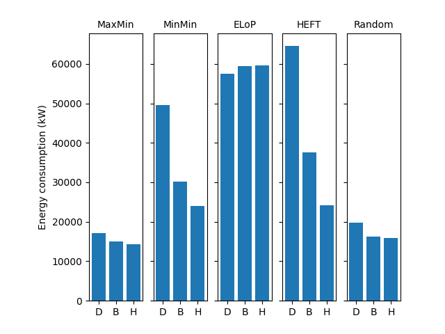
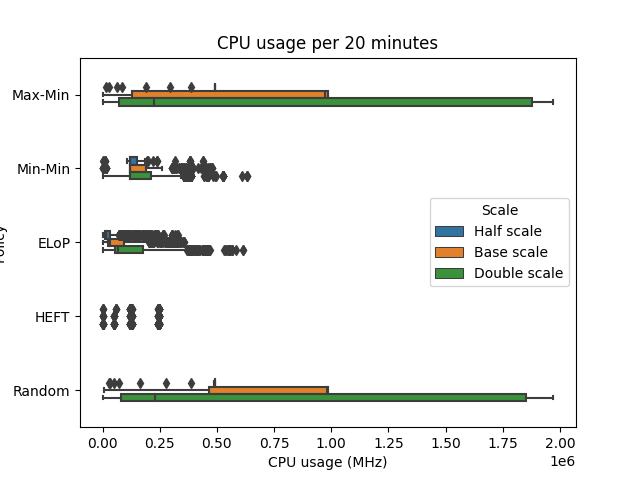
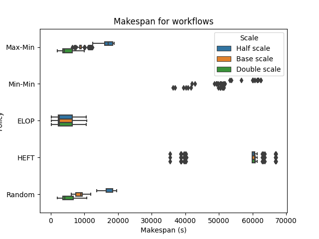
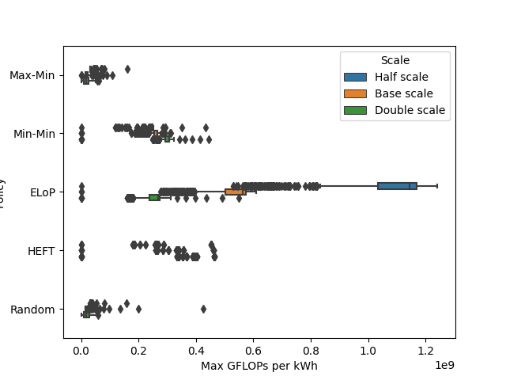

# Usage
RUN MAIN_PLOT.PY TO GET THE SHOW ON THE ROAD
The dataset is already included.

# Generated plots
Below we show which plots are generated by the script.
An example graph is always included for better understanding.

## Energy plot
Plots the energy consumption in kW over time.
The visualization is a line chart.
Each scale for the environment is in its own plot.

## Energy bar
Plots the energy consumption in kW for different scales.
The visualization is a bar chart. 
Each policy is in its own plot.

## Usage plot
Plots the CPU usage in MHz of the system as a box plot.
We separate between policies and scale.

## Makespan plot
Plots the makespan per workflow as a box plot.
We separate between policies and scale.

## CDF plot
Plots the percentage of completed tasks over time.
All scales and policies are present in the graph.

## Performance per kWh
Plots the maximum GFLOPs per kWh as a box plot.
We separate between policies and scale.

# Contribution
CAN UPDATE STRUCTURE IF NEEDED :)